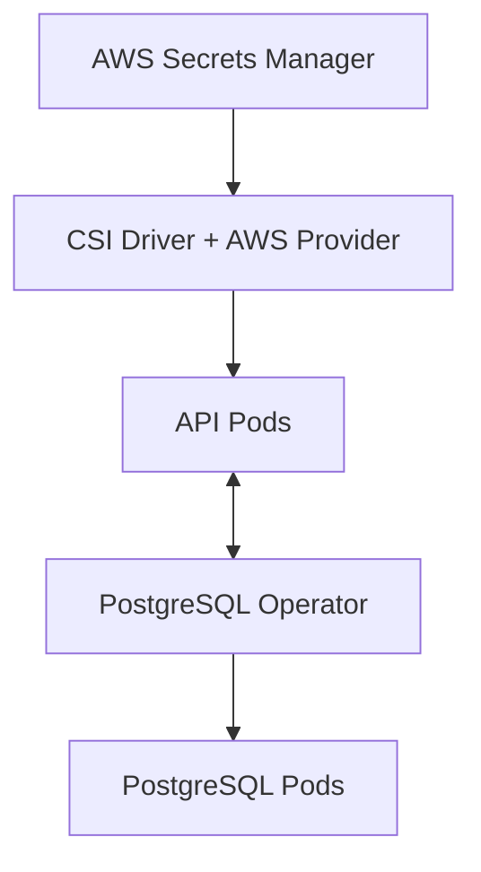

## CKM Infrastructure (ckm-infra)

#### This repository contains the GitOps infrastructure setup for the CKM platform using ArgoCD, Kubernetes, and various operators

## Architecture Overview

### Directory Structure

```bash
ckm-infra/
├── argocd/
│   ├── applications/
│   │   ├── postgres-crds.yaml        # Defines PostgreSQL CRDs
│   │   ├── postgres-operator.yaml    # Manages PostgreSQL instances
│   │   ├── postgres-rbac.yaml        # RBAC for Postgres Operator
│   │   ├── csi-secrets-store.yaml    # Base secrets mounting system
│   │   ├── aws-secrets-provider.yaml # AWS secrets integration
│   │   └── api.yaml                  # Application deployment
│   └── projects/
│       └── operators.yaml            # Project level settings
└── operators/
    ├── postgres-operator/
    │   ├── base/
    │   │   ├── crds/                 # Custom Resource Definitions
    │   │   ├── rbac/                 # Access Control
    │   │   └── operator/             # Core Operator
    │   └── overlays/
    │       └── dev/                  # Environment Specific
    └── api/
        └── base/
            ├── deployment.yaml       # Pod configuration
            ├── service.yaml          # Network exposure
            ├── configmap.yaml        # Non-sensitive config
            └── ingress.yaml         # External Access
```

### Component Workflow

#### Infrastructure Layer (Deployment Order)

1. CSI Secrets Store (Base)
2. AWS Secrets Provider
3. PostgreSQL CRDs
4. PostgreSQL RBAC
5. PostgreSQL operator
6. API Deployment

#### Data Flow



## Installation Steps

#### 1. Prerequisites

```bash
# Enable required MicroK8s addons
# choose the ip range base on your Network
microk8s enable storage dns ingress metallb:10.0.0.30-10.0.0.40
```

#### 2. ArgoCD setup

```bash
# Install ArgoCD
kubectl create namespace argocd
kubectl apply -n argocd -f https://raw.githubusercontent.com/argoproj/argo-cd/stable/manifests/install.yaml

# Access ArgoCD
kubectl port-forward svc/argocd-server -n argocd 8080:443
```

#### 3. Deploy Components

```bash
# Deploy CSI Driver
argocd app create csi-secrets-store \
  --repo https://kubernetes-sigs.github.io/secrets-store-csi-driver/charts \
  --helm-chart secrets-store-csi-driver \
  --revision 1.3.4 \
  --dest-server https://kubernetes.default.svc \
  --dest-namespace kube-system \
  --sync-policy automated

# Deploy AWS Provider
argocd app create aws-secrets-provider \
  --repo https://aws.github.io/secrets-store-csi-driver-provider-aws \
  --helm-chart secrets-store-csi-driver-provider-aws \
  --revision 0.3.4 \
  --dest-server https://kubernetes.default.svc \
  --dest-namespace kube-system \
  --sync-policy automated

# Deploy PostgreSQL Components
argocd app create postgres-crds \
  --repo https://github.com/yourusername/ckm-infra.git \
  --path operators/postgres-operator/base/crds \
  --dest-server https://kubernetes.default.svc \
  --dest-namespace postgres-operator \
  --sync-policy automated

# Wait for CRDs to sync
argocd app wait postgres-crds

# Create RBAC application
argocd app create postgres-rbac \
  --repo https://github.com/rayan147/ckm-infra.git \
  --path operators/postgres-operator/base/rbac \
  --dest-server https://kubernetes.default.svc \
  --dest-namespace postgres-operator \
  --sync-policy automated \
  --sync-option CreateNamespace=true

# Wait for RBAC to sync
argocd app wait postgres-rbac

# Finally create the operator application
argocd app create postgres-operator \
  --repo https://github.com/rayan147/ckm-infra.git \
  --path operators/postgres-operator/overlays/dev \
  --dest-server https://kubernetes.default.svc \
  --dest-namespace postgres-operator \
  --sync-policy automated

# Monitor the status
argocd app get postgres-operator


# Deploy API 
argocd app create api \
  --repo https://github.com/rayan147/ckm-infra.git \
  --path operators/api/base \
  --dest-server https://kubernetes.default.svc \
  --dest-namespace ckm \
  --sync-policy automated \
  --sync-option CreateNamespace=true

# Create Tailscale application in ArgoCD
argocd app create tailscale \
  --repo https://github.com/rayan147/ckm-infra.git \
  --path operators/tailscale/base \
  --dest-server https://kubernetes.default.svc \
  --dest-namespace tailscale \
  --sync-policy automated \
  --sync-option CreateNamespace=true

# Wait for the application to sync
argocd app wait tailscale

# Check the status
argocd app get tailscale

```

## Security Components

### CSI Driver and AWS Provider

- CSI Driver: Base infrastructure for mounting secrets
- AWS Provider: Handles AWS Secrets Manager integration
- Together they enable secure secret management

### PostgreSQL Security

- RBAC configurations for database access
- Operator manages database lifecycle
- Secure connection handling

### Application deployment

#### The API deployment includes

- Resource limits and requests
- Health checks (liveness and readiness probes
- Secret mounting configurations
- Service and ingress definitions

### Notes

- All sensitive configurations are managed through AWS Secrets Manager
- ArgoCD handles GitOps workflow
- PostgreSQL operator manages database instances
- Infrastructure is version controlled and automated
